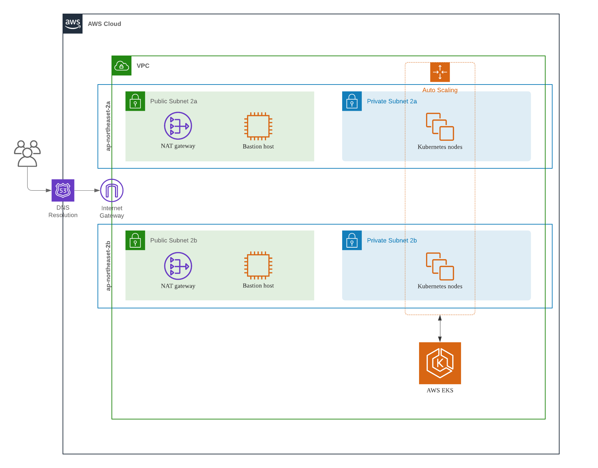

# Terraform
This repository contains Terraform based IaC source codes for provisioning AWS
EKS Cluster. The source codes aims to provision and build a robust, simple,
fast, efficient and light-weighted AWS EKS Cluster.

## AWS EKS Cluster

### Architecture



- VPC
  - Available Zone 2A
    - Public Subnet 2A
      - NAT Gateway
      - Bastion Host
    - Private Subnet 2A
      - Kubernetes Worker Nodes
  - Available Zone 2C
    - Public Subnet 2C
      - NAT Gateway
      - Bastion Host
    - Private Subnet 2C
      - Kubernetes Worker Nodes

The architecture supports HA(High Availability), in Active-Active mode, which is
essential to provide a robust, efficient and (most importantly) stable
environments where service pods can be deployed and served. Also, auto-scaling
feature for Kubernetes worker nodes is set to automatically scale in and out the
nodes to handle more flexibly the change of service ingress traffic.

The architecture's features are as follows:
- HA
- Auto Scaling
- Security
  - VPC
  - Public and Private Subnets
  - Security Group
  - Bastion

### Usage

#### Prerequisites
- `terraform`
- `aws` CLI tool
- `kubectl`

#### Prepare
```bash
export AWS_ACCESS_KEY_ID="<AWS_ACCESS_KEY_ID>"
export AWS_SECRET_ACCESS_KEY="<AWS_SECRET_ACCESS_KEY>"
```
Change on `main.tf` module variable values as you want. For example, you can set
`["ap-northeast-2a", "ap-northeast-2b", "ap-northeast-2c"]` to `aws_azs` if
you'd like to support 3 AZs (Don't forget to update `aws_public_subnets`,
`aws_private_subnets` and Bastion module's `aws_instance_type`).

The following commands are executed under
`deployments/eks-<with/without>-bastion`

#### Initialize
```bash
terraform init
```

#### Plan
```bash
terraform plan
```

#### Apply
```bash
terraform apply
```

#### Verify
```bash
aws eks update-kubeconfig \
  --region ap-northeast-2 \
  --name <cluster_name>
kubectl get nodes
```
Then, you would see results as follows:
```bash
NAME                                                 STATUS   ROLES    AGE    VERSION
ip-192-168-101-141.ap-northeast-2.compute.internal   Ready    <none>   124m   v1.20.7-eks-135321
ip-192-168-101-38.ap-northeast-2.compute.internal    Ready    <none>   125m   v1.20.7-eks-135321
ip-192-168-102-32.ap-northeast-2.compute.internal    Ready    <none>   125m   v1.20.7-eks-135321
```
